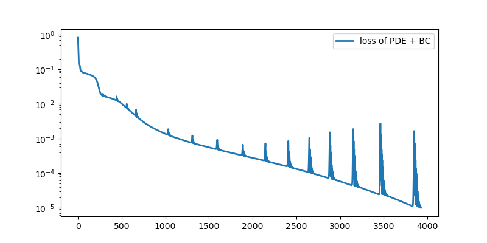
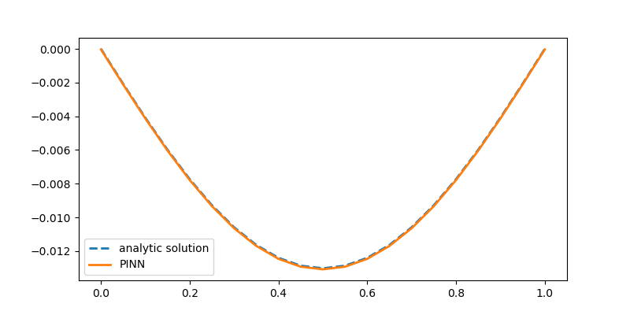

# Physics informed neural network for approximating the deformed shape of a beam   

We consider a beam on two supports and with a distributed load.  

We approximate the numerical solution of the differential equation of the beam with a neural network:   

$$EI \frac{\partial ^4 u}{\partial x ^4}  - p = 0$$    

$$u(0)=0, \, u(L)=0, \, \frac{\partial^u}{\partial x^2}(0)=0, \, \frac{\partial^u}{\partial x^2}(L)=0.$$   

We use the [TensorFlow](https://www.tensorflow.org/) library for machine learning.    

Evolution of loss function during training of the PINN:   

Comparison of the numerical approximation obtained with the PINN, and the analytical solution of the beam deflection:   

